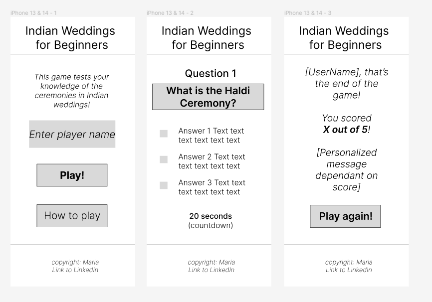
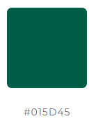
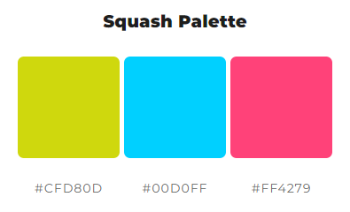

# Indian Weddings for Beginners - A Quiz

Visit the live site [here](https://mariahochstoeger.github.io/project2/).


This is a quiz about Indian weddings. It lets the user test their knowledge about some of the most common events - usually called "functions" - of a traditional Indian Hindu wedding. On the website and in this readme, the terms "Hindu wedding" and "Indian wedding" are used interchangeably.

## Table of Contents

1. [Design](#design)
2. [Features](#features)
3. [UX](#ux)
4. [Testing](#testing)
5. [Sources](#sources)
6. [Credits](#credits)

## Design

The site was created with persons in mind who have not had any point of contact with traditional Indian weddings so far. The aim was to evoke feelings of joy and celebration, and a distant association to India, through colors and fonts. Besides that, the design is kept very simple and minimal as to not distract the user from the quiz and reading and answering the questions.

### Wireframes

The wireframes were made in Figma. A mockup of a mobile screen was chosen since the site was built using the mobile-first approach. The wireframes were kept very simple and the focus was on structure rather than design. The wireframes also include a countdown field which was not implemented in the basic version of the game. It is a possible future feature.



### Font and Colour Choices
**Fonts:** 'Laila' was chosen as the font for the header and main headings for its playful design with its slight nod to the Indian letters used for Hindi, Devanagari, through its gentle flares and curles at the end of the letter strokes. 'Poppins' makes up the main part of the site due to it being a quite neutral, easy-to-read but still friendly font.

**Colours:** The colour palette was generated using [mycolor.space](https://mycolor.space/?hex=%23FA00A6&sub=1). The reference colours were picked from the inspiration image (taken from Pexel) which shows a man with his face full of paint powder, which is common during one of the biggest Indian festivals, Holi, also called the Festival of Colors. Although Holi does not have an association with Indian weddings, the color scheme was chosen as these types of colors are often associated with India more broadly. Furthermore, the colors are bright, vivid and fun, which is an association the quiz would like to evoke.

Inspiration image: <br>
 <br>
<br>
<br>


**Images:** No images are displayed on the site itself. As described above, an inspiration image was used to generate the colour palette.

## Features

The site has the basic features of a static website as well as some interactive features written in JavaScript.

- **Header**
    - ...

- **Main section**
    - ...

- **Footer**
    - The footer contains a copyright symbol and the author's, ie me, name.
    - There is a LinkedIn icon.
    - The icon opens in a new tab, making it easy for users to come back to the quiz site.
    - The footer is consistent throughout the pages.

    

### Possible Future Features

- Include a video

    Dr. Giri has given a Ted Talk. I would like to embed this video directly on the about page.

- Improve the about page

    Make the costs on the about page into a table giving an easier overview to the site visitor.

- Give the user more options with the form

    I would like to give the site visitor the option to choose whether they would like to be contacted via email or via phone, and if phone, at which times.

## UX

### Site Goals

The site wants to attract people who face mental or psychological challenges in their lives and are looking for professional help from a qualified psychotherapist. Particularly, the site should speak to English- or Hindi-speaking people located in Vienna, or who would like to try psychotherapy online. 

### User Stories

**As a site visitor:**

- I want to confirm that Dr. Giri is a qualified psychotherapist.
- I want to know which languages Dr. Giri speaks.
- I want to learn about the types of sessions he offers.
- I want to know how much a session costs.
- I want to find out whether Dr. Giri specializes in the field which I struggle with.
- I want to see where Dr. Giri is located.
- I want to be able to get in contact with Dr. Giri in the manner that I choose to.
- I want to see a mobile-friendly layout and responsive design.

**As the site administrator:**

- I want to be able to easily update information such as pricing or location.
- I want to be able to add new content such as videos.

## Testing

- I confirmed that this project is responsive and looks good on various common screen sizes by using the devtools devices toolbar.
- I have confirmed that the form works and each field is required. There are error messages if a field is not filled out. If it is filled incorrectly, such as an @ missing in an email, or the phone number field containing letters, there are appropriate error messages.
- I confirmed that header and navbar are easily readable and understandable.

### Fixed Bugs

- Imported Google Fonts into html via <link>. This caused css-classes and -ids to not be applied. Fixed it by removing Google Fonts link from index.html and instead importing Google Fonts into style.css.
- Various flexbox styling problems. Fixed flexbox styling by applying differently colored borders to better understand the individual elements' behaviours. Border colors were removed after fixing the styling.

### Unfixed Bugs

- None.

### Validator Testing

- HTML ([W3C Validator](https://validator.w3.org/))
    - 3 errors found: two out of three errors were "section lacks heading". The other one was "The element ```a``` must not be a descendent of the `button` element."
    - Solution: introduced headings to the two relevant sections and set them to non-displayed. Styling the `a` as a button and removing the button element.

- CSS ([Jigsaw](https://jigsaw.w3.org/css-validator/))
    - 1 error found: "min-width too many values or values are not recognized: `none`".
    - Solution: removed min-width. It wasn't necessary anyways.

- Performance, Accessibility, Best Practices, SEO (Lighthouse Chrome Dev Tools)
    - Accessibility is at 100, which is what the focus was one.
Performance is mediocre, also after compressing images.
    - 

### Browser Testing (section adapted from Kay Welfare, results are my own)

**Layout:** Testing layout and appearance of site for consistency throughout browsers.

**Functionality:** Ensuring all links, navigation and form submit functions as expected throughout browsers.

| Browser     | Layout      | Functionality |
| :---------: | :----------:| :-----------: |
| Chrome      | ✔          | ✔             |
| Edge        | ✔          | ✔             |
| Firefox     | ✔          | ✔             |
| Safari*     | only available to me on iPhone |
| IE          |deprecated by Microsoft, not tested|

*I asked my peers to review the site for me in Safari and one colleague came back with no bugs found (he made suggestions on styling which I did not implement since I considered them personal preference).

### Manual Testing (section adapted from Kay Welfare, results are my own)

| Feature     | Expect      | Action        | Result |
| :---------: | :----------:| :-----------: | :-----:|
| **Logo Icon**   | When clicked, home page will open   | Clicked Logo Icon  | Home page opened when clicked |
| **Navbar Buttons**  | When clicked, the respective page will open  | Clicked all individual navbar buttons | All respective pages opened when button was clicked |
| **Book A Session Now! Button** | When clicked, Contact page will open  | Clicked on the Book A Session Now! Button | Contact page opens |
| **Email link on contact page** | When clicked, a blank email will open with the email address as the recipient | Click email link | New blank email opens with email address as recipient |
| **Social link icons** | Social link icons open relevant websites in new tab when clicked | Click all individual icons | All respective sites open in new tab |
| **Form submit button** | Form submits when submit button is clicked | Fill out form and click submit button | CI form dump page opens and displays form contents |
| **Required form fields** | Form will not submit if required fields are blank and/or filled incorrectly, and fields will be highlighted and flagged | Fill out form incorrectly | Form does not submit and highlights incorrectly filled-in fields and gives prompts what may be wrong (eg @-sign missing in email address field) |

### Testing User Stories (section adapted from Kay Welfare, results are my own)

| Expectation                         | Result                          |
| :---------------------------------: | :------------------------------:|
| I want to confirm that Dr. Giri is a qualified psychotherapist | As a visitor, I can see that Dr. Giri is a psychotherapist on the home page, his full title is visible on the contact page |
| I want to know which languages Dr. Giri speaks | As a visitor, I can find the languages which Dr. Giri offers sessions in on the about page |
| I want to learn about the types of sessions Dr. Giri offers | As a visitor, I can find the types of sessions which Dr. Giri offers on the about page |
| I want to know how much a session costs | As a visitor, I can find the costs of the various types of sessions on the about page |
| I want to find out whether Dr. Giri specializes in the field which I struggle with | As a visitor, I can find the fields Dr. Giri specializes in on the about page |
| I want to see where Dr. Giri is located | As a visitor, I can find Dr. Giri's practice's address on the contact page |
| I want to be able to get in contact with Dr. Giri in the manner that I choose to. | As a visitor, I can choose to get in contact with Dr. Giri in the manner I prefer, whether this is to send an email, or call, or have Dr. Giri contact me |
| I want to see a mobile friendly layout and responsive design | As a visitor, I have a good view of the site on mobile device without overflow or side-scrolling |

## Deployment

This site was deployed on GitHub Pages:
- From the repository, first navigate to "Settings" (top of the page) and then "Pages" (left of the newly opened page)
- Under "Source" choose "Deploy from a Branch" in the dropdown menu
- Choose the "main" Branch, and folder "/(root)"
- Click "save"
- The website is subsequently deployed (this may take a few minutes) on GitHub Pages
- To get there, in the "Code" tab of the repository, on the right-hand side under "Environments" click on "github-pages"
- On the newly opened page, on the right-hand side, click on "View deployment"

## Sources

- Love Running walk-through project for basic structures of header and footer
- Favicon: <a target="_blank" href="https://icons8.com/icon/ZFiK6ATniCG5/heart">Heart</a> icon by <a target="_blank" href="https://icons8.com">Icons8</a>
- The mock-up image of the site on different devices was generated using [techsini.com](https://techsini.com/multi-mockup/)
- All images taken from pexels.com
- Images were compressed using [iloveimg.com](https://www.iloveimg.com/)
- //Icons were taken from [fontawesome.com](https://fontawesome.com/)

## Credits
- Modal: https://www.w3schools.com/howto/howto_css_modals.asp
- Quiz: Tutorial from https://www.youtube.com/watch?v=PBcqGxrr9g8&t=118s 
- How to make the inspiration image in this readme.md file smaller: https://stackoverflow.com/questions/14675913/changing-image-size-in-markdown